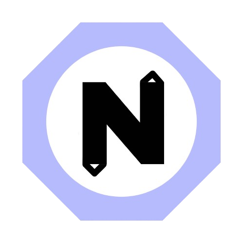

<p align="center">
  
</p>

<h1 align="center">SparkNotes</h1>
<p align="center">
  <strong>A beautifully crafted note-taking app by <a href="https://sparkware-llc.github.io/Sparkware/">Sparkware</a></strong><br/>
  <sub>Built with Flutter · Designed for Android</sub>
</p>

<p align="center">
  
  
  
  
</p>

---

## What is SparkNotes? 🗒️

SparkNotes is a powerful, expressive note-taking app that goes beyond plain text. Whether you're jotting down quick thoughts, managing tasks, sketching ideas, or planning your month, SparkNotes keeps everything in one place with a UI that actually feels good to use.

---

## Features ✨

**Rich Note Types**
SparkNotes supports multiple note formats out of the box. Write free-form text notes, build structured todo lists with checkboxes, sketch on a full doodle canvas, and organize everything through a calendar view.

**Doodle Canvas 🎨**
Express ideas visually with a built-in drawing canvas. Perfect for diagrams, quick wireframes, or just a scribble you don't want to forget.

**Todo Lists ✅**
Create checklist-style notes for tasks, shopping lists, and anything you need to track step by step.

**Calendar View 📅**
Browse your notes by date in a full calendar layout. Never lose track of when something was written.

**Custom Onboarding**
A fully custom onboarding flow eases new users into the app without ever feeling generic or out of place.

**Deep Theming 🎨**
SparkNotes is built from the ground up for personalization. Accent colors, dark mode, and layout preferences are first-class citizens of the app.

---

## Tech Stack 🛠️

| Layer | Technology |
|---|---|
| Framework | Flutter |
| Language | Dart |
| Font | JetBrains Mono NerdFont |
| Accent Color | `#8B8FF4` Periwinkle |
| Platform | Android |

---

## Getting Started 🚀

**Prerequisites**

Make sure you have the Flutter SDK installed and an Android device or emulator ready.

```
flutter --version   # Should be 3.x or later
```

**Clone and Run**

```bash
git clone https://github.com/sparkware-llc/sparknotes.git
cd sparknotes
flutter pub get
flutter run
```

**Build a Release APK**

```bash
flutter build apk --release
```

The output APK will be at `build/app/outputs/flutter-apk/app-release.apk`.

---

## Project Structure 📁

```
lib/
  main.dart              # Entry point
  app/                   # App-level config, theming, routing
  features/
    notes/               # Note editor, types, and models
    todos/               # Todo list logic and UI
    doodle/              # Canvas and drawing tools
    calendar/            # Calendar view and date navigation
    onboarding/          # Custom onboarding flow
  shared/                # Widgets, constants, and utilities
```

---

## Contributing 🤝

SparkNotes is a Sparkware project. Contributions, issues, and feature requests are welcome. Feel free to open an issue or submit a pull request.

**Before contributing**, please make sure your code follows the existing style and that all existing tests pass:

```bash
flutter test
flutter analyze
```

---

## License 📄

This project is licensed under the MIT License. See [LICENSE](LICENSE) for details.

---

<p align="center">
  Made with 💜 by <a href="https://sparkware-llc.github.io/Sparkware/">Sparkware</a>
</p>
